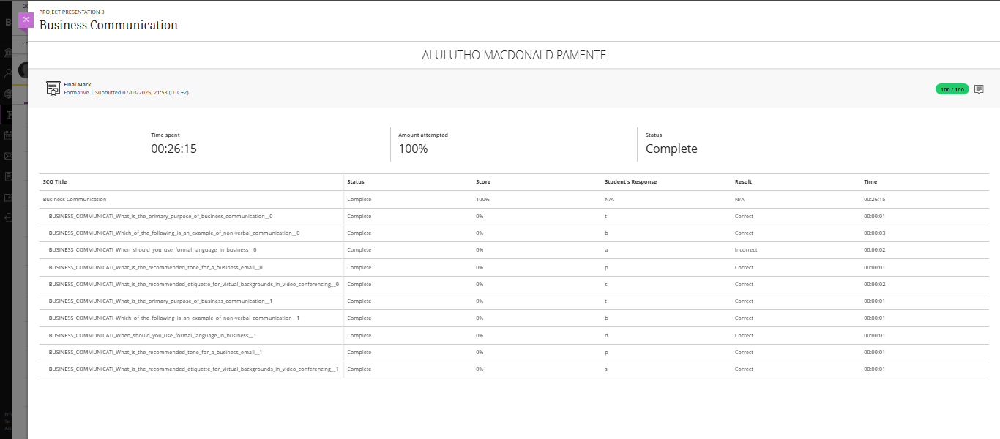

###   Evidence

### Reflection: Business Communication

**S – Situation**  
During the PRP370S Work Readiness Training, I completed the Business Communication module, which focused on understanding professional workplace communication — including formal language, business emails, video conferencing etiquette, and non-verbal communication.

**T – Task**  
My goal was to develop strong professional communication skills that are essential in the modern workplace. This included learning how to communicate clearly, professionally, and appropriately in both written and virtual environments.

**A – Action**  
I studied various aspects of business communication, such as the correct tone for business emails, the importance of formal and respectful language, and proper etiquette during video meetings (e.g., virtual background settings and body language). I also improved my understanding of non-verbal communication cues like facial expressions, posture, and eye contact. This module required me to apply my critical thinking to select the most professional response in different business scenarios.

**R – Result**  
I gained a deeper understanding of how to communicate professionally and confidently in a workplace setting. I now know how to adapt my tone, structure, and behavior depending on the communication context. This module has prepared me to interact professionally with clients, colleagues, and stakeholders in both physical and virtual environments — an essential skill for success in the ICT and multimedia industry.
