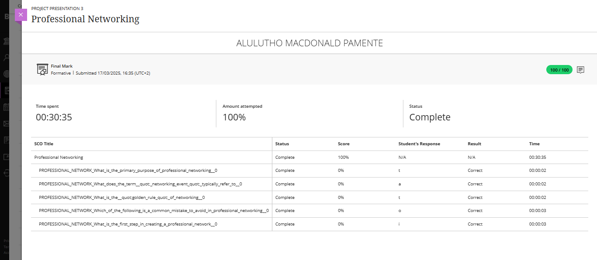

### Evidence

### Reflection: Professional Networking

**S – Situation**  
As part of the PRP370S Work Readiness Training, I completed the Professional Networking module, which focused on understanding the importance of building professional relationships for career growth. The module explained the value of networking in gaining opportunities, sharing knowledge, and creating long-term industry connections.

**T – Task**  
My task was to understand how to build and maintain a strong professional network, while also learning the correct strategies and behavior to follow — especially during networking events or online professional platforms like LinkedIn.

**A – Action**  
I learned about the primary purpose of professional networking, how networking events typically work, and the importance of the “golden rule” — offering value before expecting something in return. I also learned what mistakes to avoid, such as being overly self-focused or forgetting to follow up. I studied the correct first step in building a professional network, which is identifying my personal goals and the people or industries relevant to my career path.

**R – Result**  
I gained a strong understanding of how professional networking opens doors to career opportunities and meaningful collaborations. I now know how to approach networking confidently, build intentional connections, and nurture professional relationships with respect and value. These skills will be highly beneficial in growing my career in the ICT and multimedia industry.

