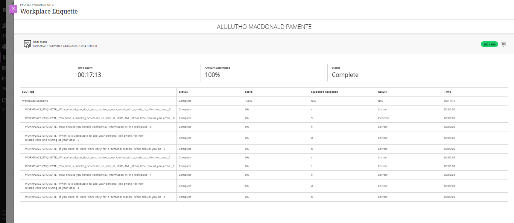
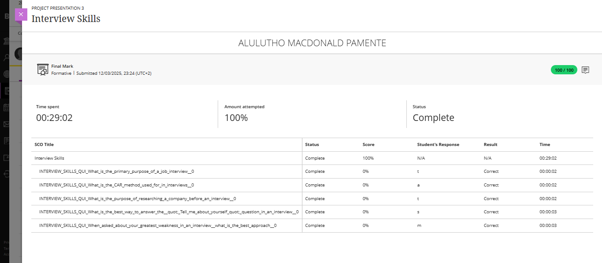

### Evidence

### Reflection: Workplace Etiquette

**S – Situation**  
As part of the PRP370S Work Readiness Training, I completed the Workplace Etiquette module, which focused on professional behavior and conduct in a formal working environment. The module covered appropriate responses to difficult situations such as rude emails, handling confidential information, punctuality, and personal phone usage in the workplace.

**T – Task**  
My task was to understand and apply the correct workplace behaviors that reflect professionalism, respect, and responsibility in different scenarios. This included learning how to respond politely to conflict, maintain confidentiality, and demonstrate reliability and discipline at work.

**A – Action**  
I engaged with different real-world workplace situations presented in the module. I learned how to appropriately respond to rude or offensive communication in a professional and respectful tone, how to handle sensitive and confidential information with care, and the importance of arriving early for meetings. I also learned the right etiquette around using personal phones during work hours and how to manage personal matters without disrupting professional responsibilities.

**R – Result**  
I am now more confident in my ability to conduct myself professionally in a workplace setting. I have developed stronger awareness of workplace expectations and how to respond maturely to challenging situations. These skills will help me maintain a positive image, build trust with colleagues, and function effectively in a professional environment — which is essential for success in my future career.
